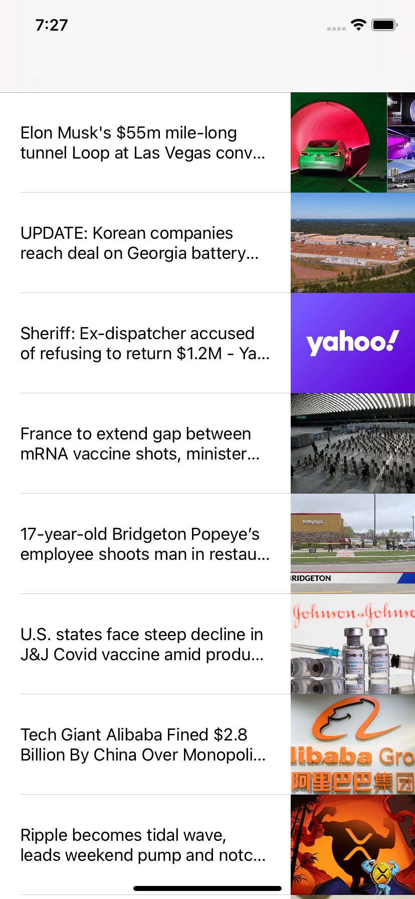

# News App
## Display news articles from newsapi.org

### First view the user sees. The headlines and images fade into view as the user scrolls

### When an article is selected, the user is segued to the web view where they read the entire article. An activity spinner will display until the article is loaded.

### Activity Spinner continues in the middle of the screen till all content is loaded from newsapi.org

### Another selected article

